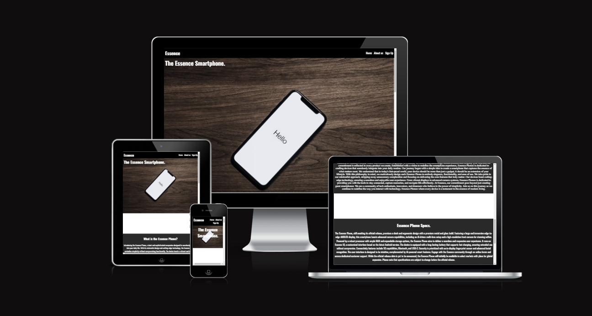
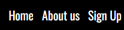
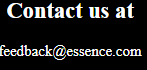
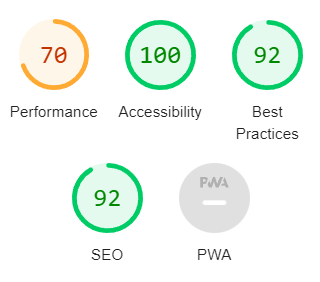

# Essence #
The Essence website is made for marketing our new phones that are to be released soon.
On this webpage you can find all the information that is available about the Essence phones and our contact information.
The site is targeted for everyone and anyone of any age.

# Features #

At the top right corner you can see the navbar 
the home button takes you to the main picture of our phone.
The about us take you to the about us section.
The Sign Up takes you to our sign up form where you can join to be notified on our release!

# Essence Phones (Release date to be announced soon) #

Welcome to the pre-release information for The Essence Phone! 

## About Essence ##
We want to redefine the smartphone experience with our new phones. Essence phones aims to set a new standard for what its users can expect from their smartphones.

## Key Features ##
1. New technology
2. Easy to use design
3. User Centric innovation

## Upon release ##
We will start a community where essence phone users can connect share thoughts and get to know updates before they are released.
You will get an easy guide how to set up your new Essence Phone.

## Contact Us ##
As we wait for the offical release you can contact us at feedback@essence.com for any feedback and questions!

See you soon!

Essence Phones

## Credits ##
The code content to make the social media links was taken from the CI Love Running project.

## Media ##
All images were taken from pexel.

All text content was generated by chatgpt ai.

## Testing ##
* I tested the site on google chrome.

* This project is responsive and functions all standard devices.

* All the clickable links works good and do what they are told to.

* The sign up form works. Upon submission you are take to the codeinstitute form dump.

## Bugs ##

I had no bugs when deploying the final project.

## Validator testing ##

* Html
No erros were found when running it thourh the official w3c validator.

* Css
No errors were found when running it through the official (jigsaw) validator.

* Accessibility 
I confirmed that the fonts and colors chose were easy to read and accessible by running it through Lighthouse in devtools.

